# ArcticAC - End User Flow & Screen Guide

This document provides a visual walkthrough of the **ArcticAC** platform from an end-user's perspective. It shows how a customer can discover services, book a technician, and manage their account.

## 1. Discovery & Home Page

When a user first lands on the platform, they are greeted by a clean, modern interface that immediately highlights the core value proposition: fast, reliable AC service with real-time tracking.

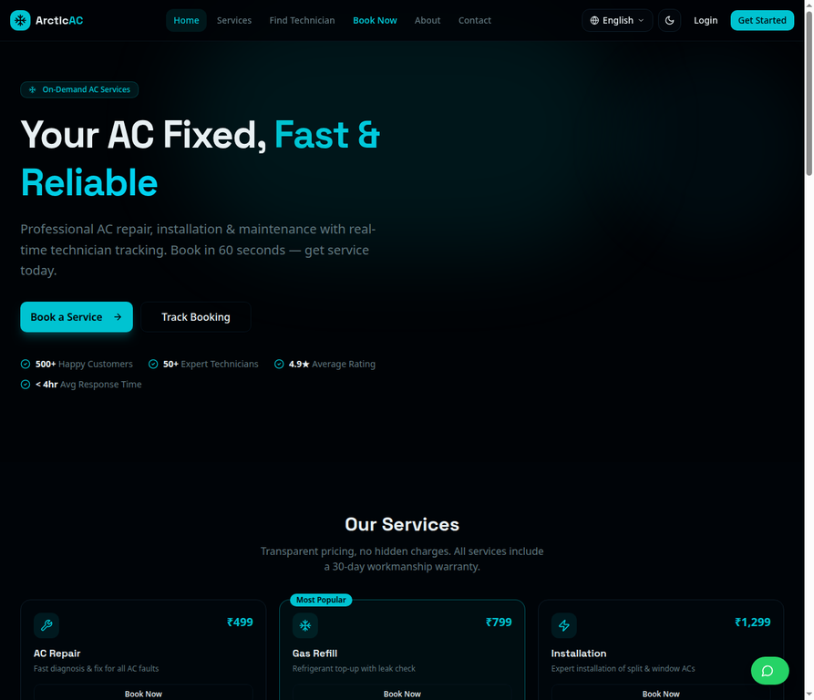

Scrolling down, users can see the most popular services with transparent pricing, followed by a clear "How It Works" section that explains the 4-step process.

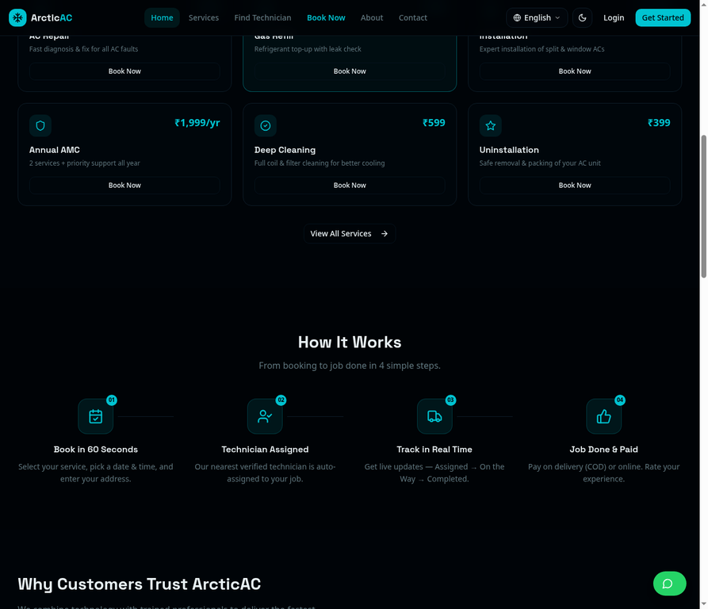

## 2. Exploring Services

Users who want to see the full catalog can navigate to the **Services** page. Here, every service (Repair, Gas Refill, Installation, Deep Cleaning, etc.) is detailed with starting prices and what is included.

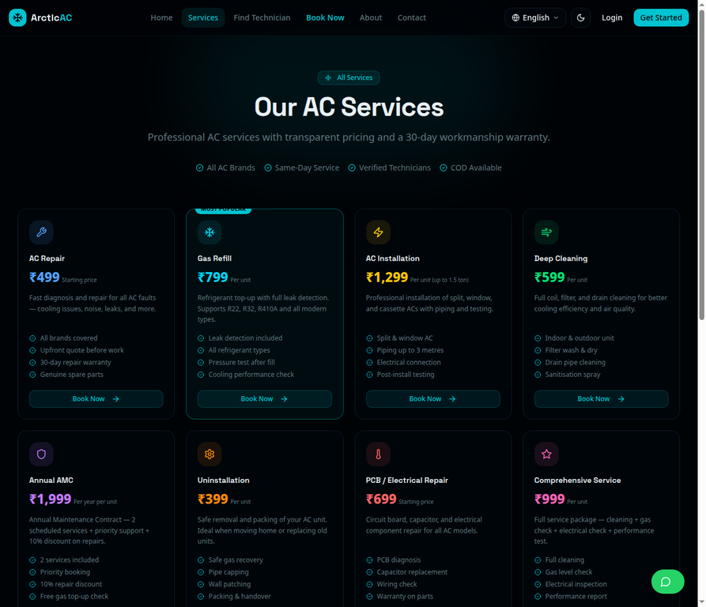

## 3. The Booking Flow

The core feature of the platform is the seamless booking wizard. 

**Step 1: Select a Service**
The user selects the service they need. The UI clearly highlights their selection before they proceed.

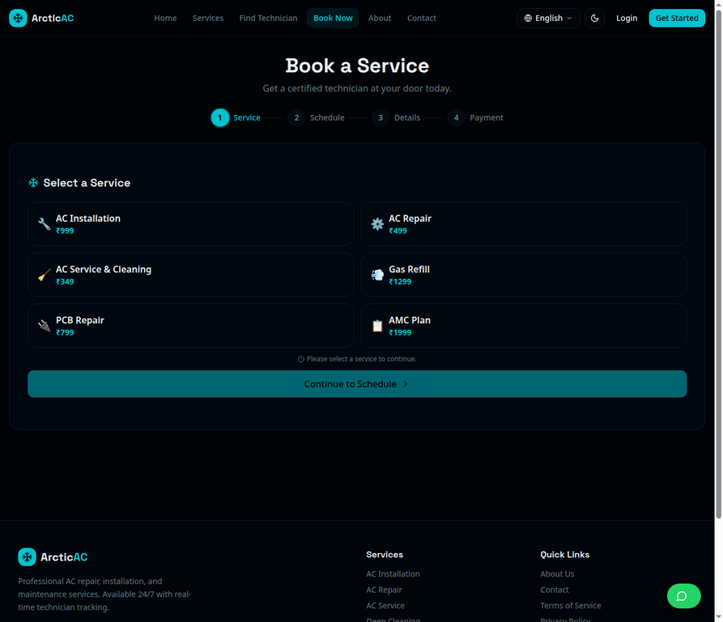

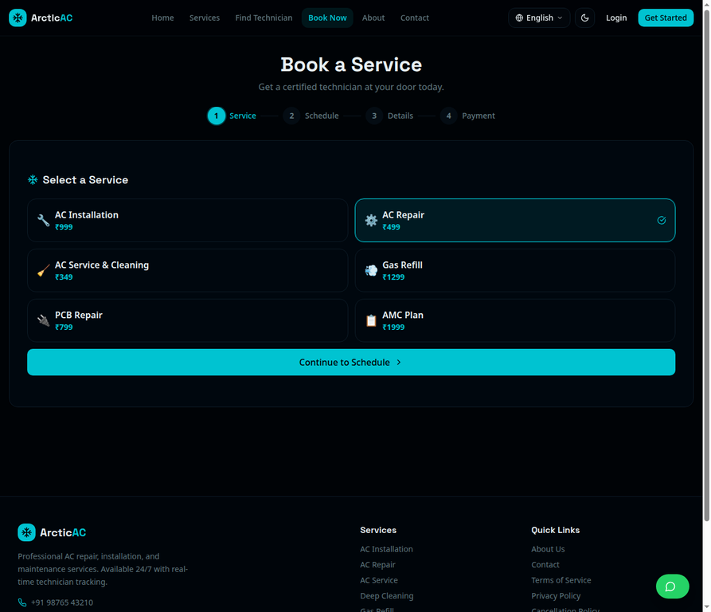

**Step 2: Schedule & Location**
The user picks a preferred date and time from an interactive calendar. They can also use the **"Use My Current Location"** button to auto-fill their address via GPS.

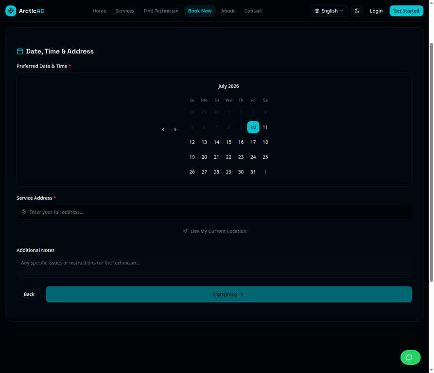

*(Following this, the user proceeds to enter details and complete payment/COD selection).*

## 4. Live Technician Locator

Users who want to see if technicians are available nearby right now can use the **Find Technician** feature. This map-based interface shows verified technicians, their current distance, ETA, and availability status (Available vs. Busy).

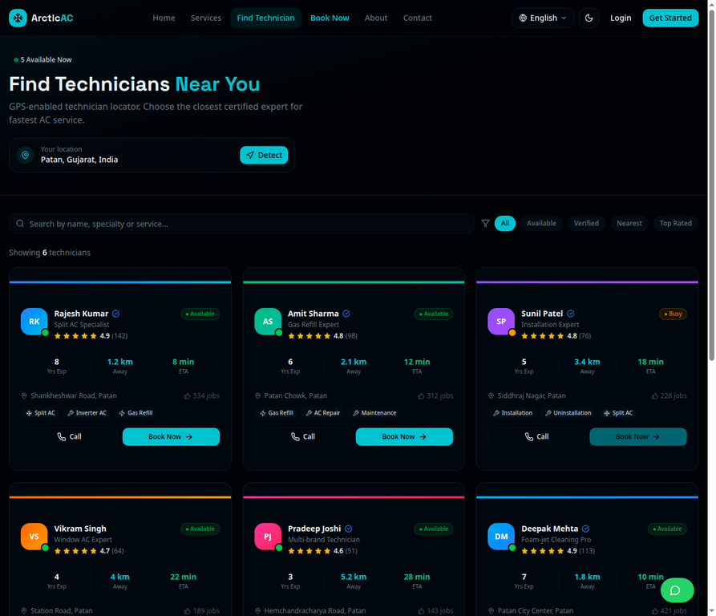

## 5. Account Management

To manage bookings and track history, users can create an account or sign in.

**Login & Registration**
The authentication pages are designed to be simple and frictionless.

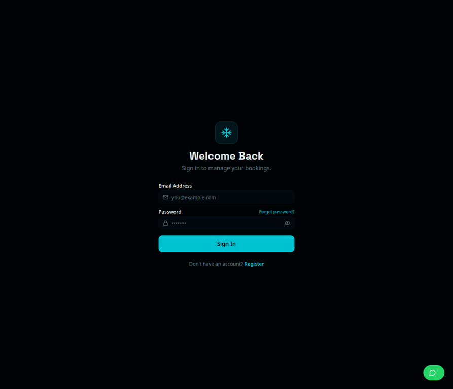

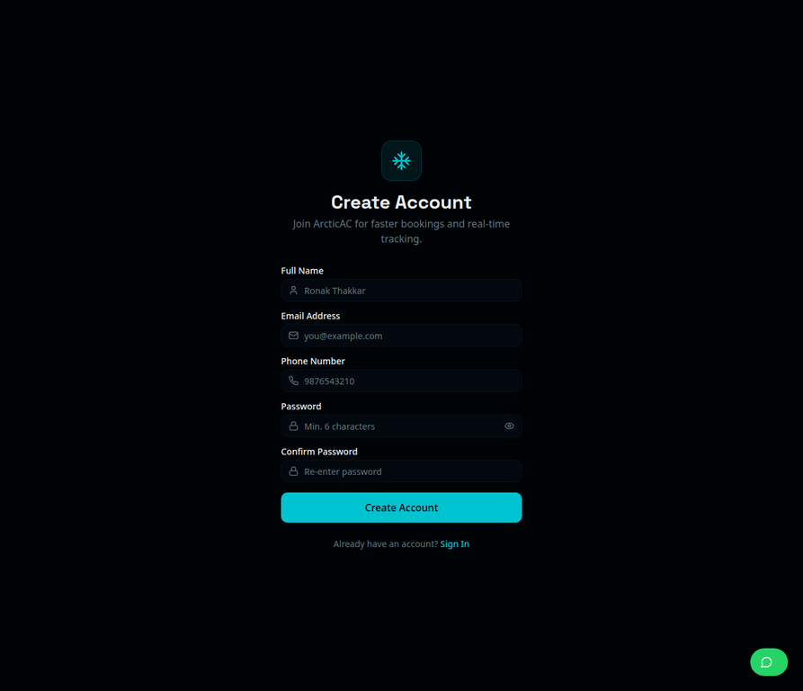

**My Bookings Dashboard**
Once logged in, users can view all their past and upcoming service requests in one place.

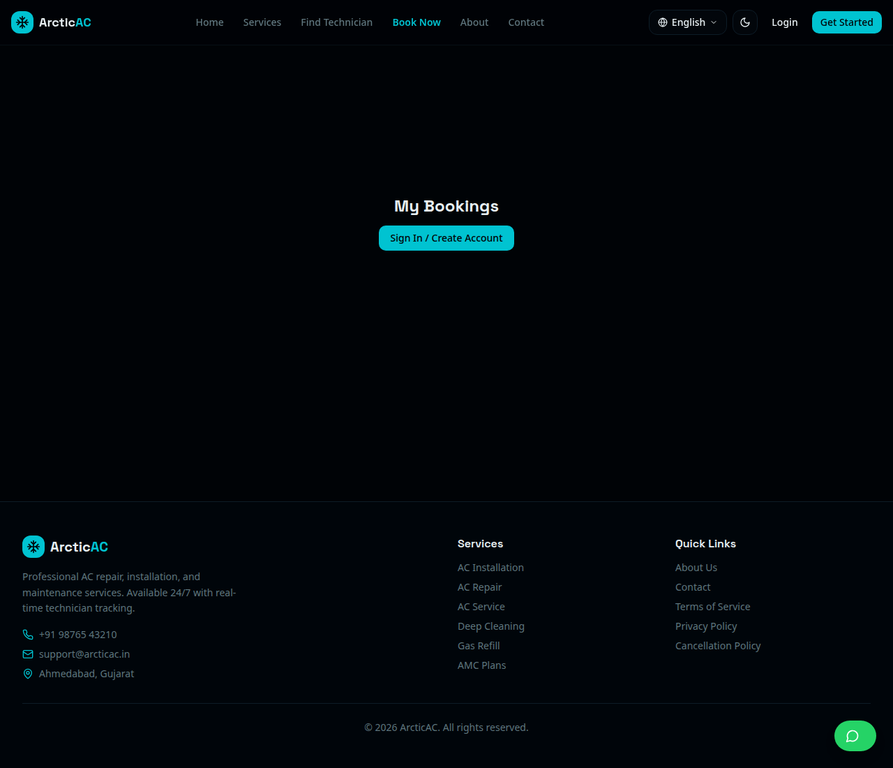

## 6. Technician Portal

The platform also includes a dedicated, mobile-optimized portal for technicians to manage their assigned jobs, update statuses, and upload completion photos.

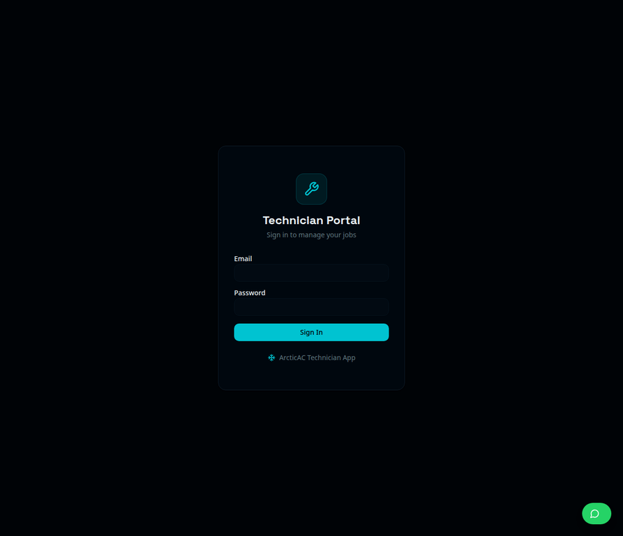

---
*Documentation generated by Manus AI*
