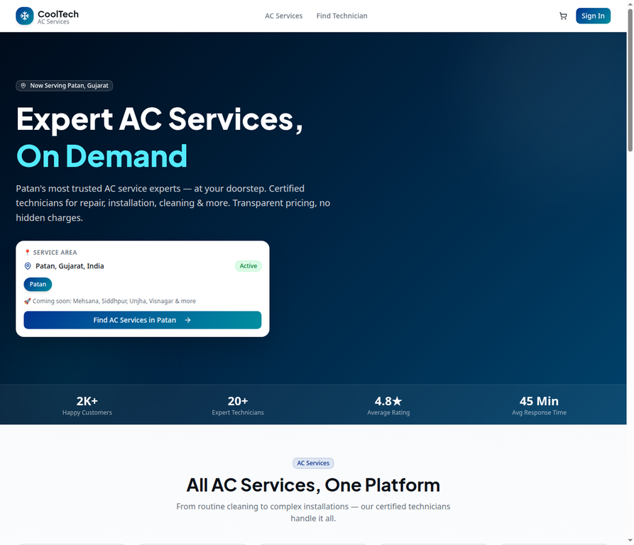
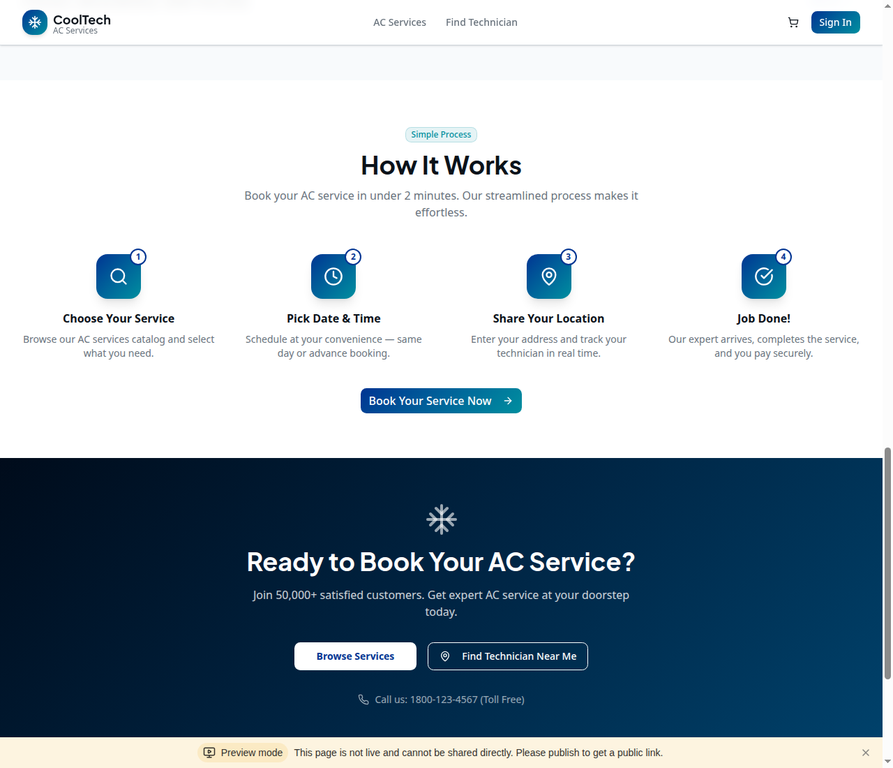
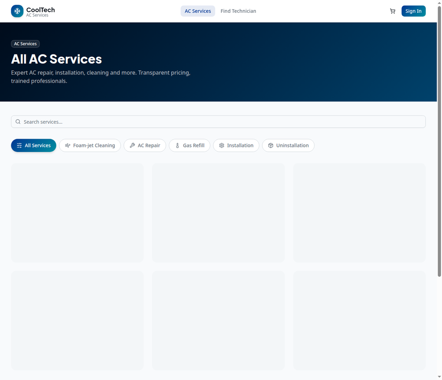
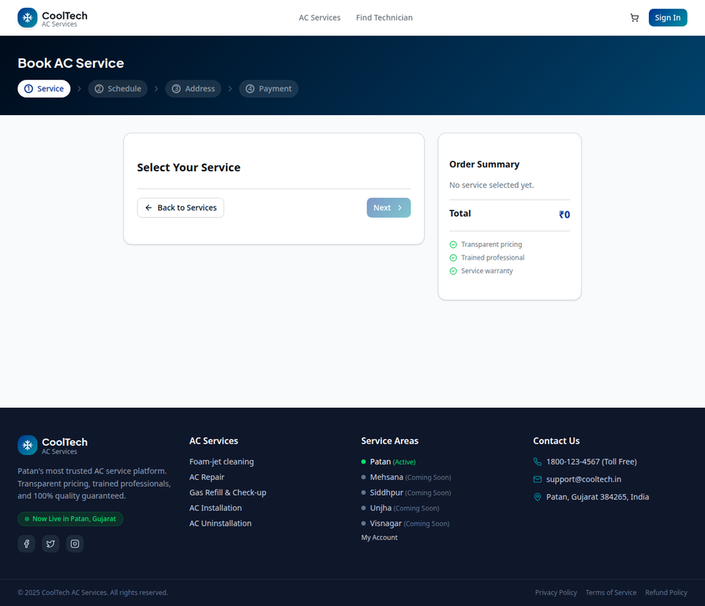
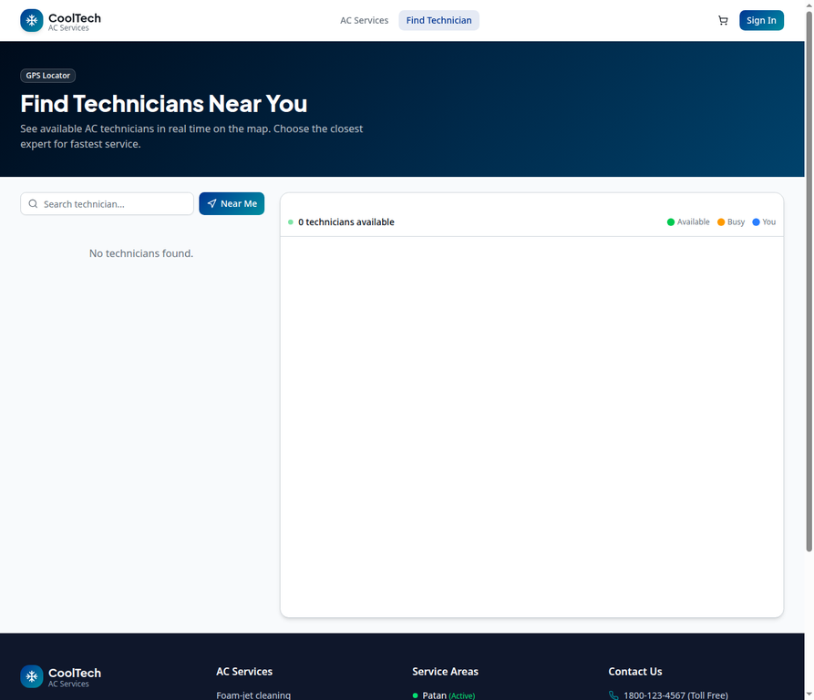
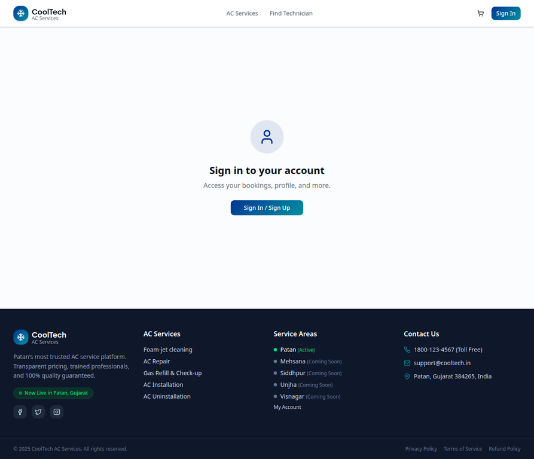
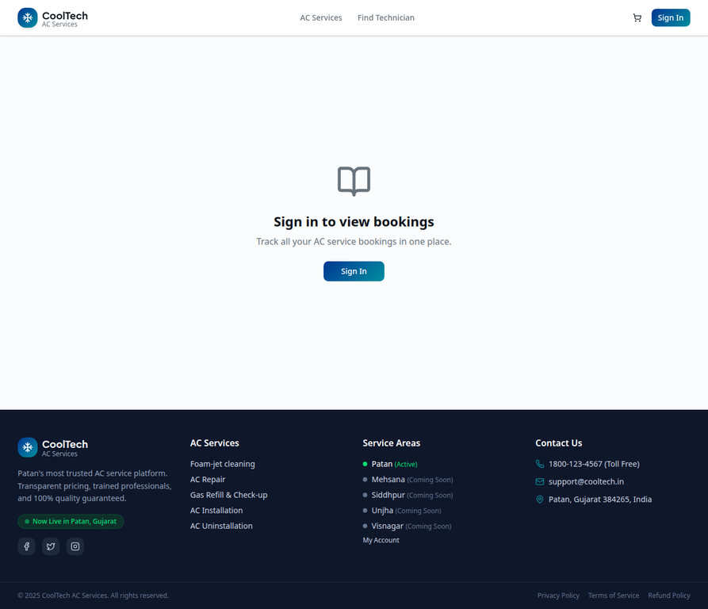
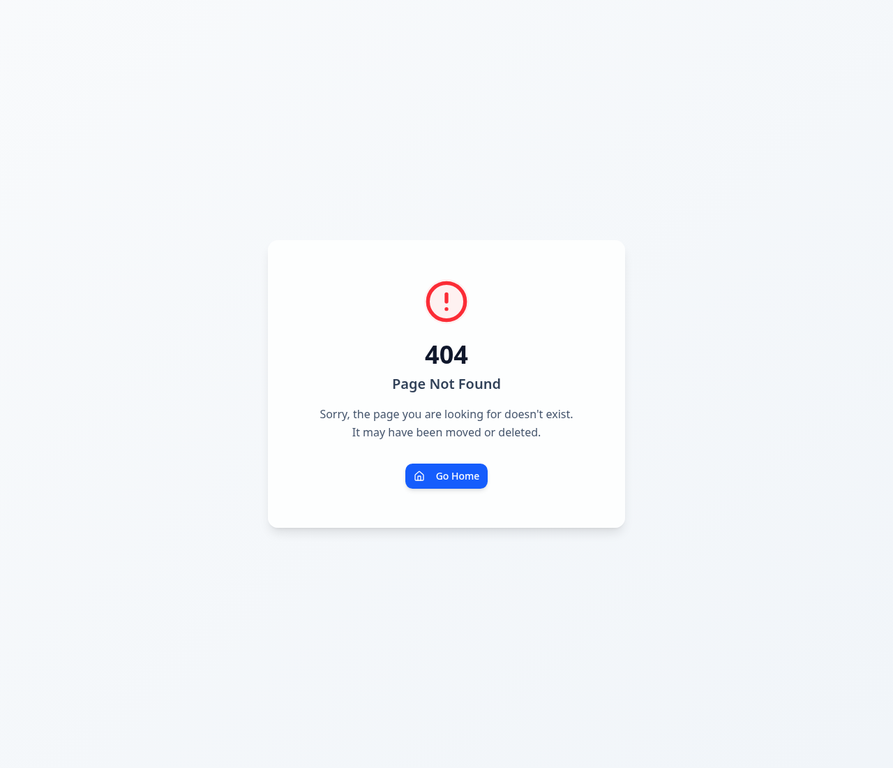

# CoolTech AC Services - System Flow & Screens

This document outlines the user flow and screens for the CoolTech AC Services platform, an end-to-end AC repair and installation booking system.

## 1. Home Page

The home page is the main landing area, designed for high conversion and clear value proposition. It features a service area indicator (currently serving Patan), trust badges, and quick links to top services.

Scrolling down, users can see the "How It Works" section, which clearly explains the 4-step process from booking to job completion.

## 2. Services Catalog

The Services page (`/services`) lists all available AC services. Users can filter by category (Foam-jet Cleaning, AC Repair, Gas Refill, Installation, Uninstallation) or search for specific services.

## 3. Booking Flow

The booking process (`/book`) is a multi-step wizard that guides the user through selecting a service, scheduling a date and time, providing their address (with Mappls GPS integration), and completing payment.

**Step 1: Select Service**
Users review their selected service and see the total cost transparently before proceeding.

## 4. Technician Locator (Live Map)

The Technician Locator page (`/technicians`) uses the Mappls Map SDK to show available technicians in the user's area in real-time. Users can see who is "Available" vs "Busy".

## 5. User Account & Authentication

The platform uses a secure OAuth flow (via Mappls Auth) for user login. The Account page (`/account`) prompts users to sign in to access their profile.

Once signed in, users can view their past and upcoming bookings on the Booking History page (`/bookings`).

## 6. Error Handling (404)

A clean 404 page is provided for any invalid routes, ensuring users can easily navigate back to the home page.

---
*Generated by Manus AI*
